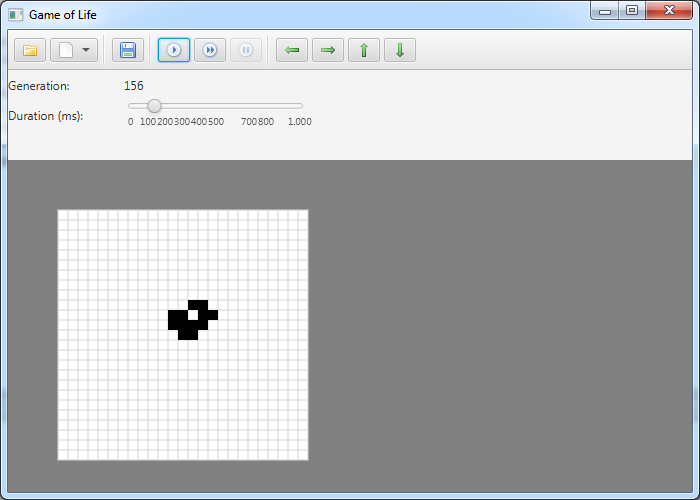

Game of Life
============

Zusammenfassung meiner gewonnenen Ideen beim Coderetreat (Game of Life) des
 [5. Hackcamp in Wolfsburg](http://hackcamp-wolfsburg.de/hackcamp5).

# Features #
- Modellieren einer Population per GUI
- Speichern / Laden des Spielstands
- Navigation per Toolbarbutton
- Schrittweise Populationsentwicklung
- Automatische Populationsentwicklung
    * konfiguierbare Geschwindigkeit
- Zoomen per Mausrad
- Unterschiedliche Bretttypen
	* Brett mit fester Breite und Höhe
	* Torusförmiges Brett mit fester Breite und Höhe
	* Unendlich großes Brett
- einige vordefinierte Populationen
- einfügen von im "Life 1.06" Format vordefinierter Figuren per Rechtsklick

# Frameworks #
- JUnit
- JavaFX
    - GUI Erstellung mit JavaFX Scene Builder
    - CSS Styling (Toolbarbuttons)
    - Zeichnen auf Canvas
- Jaxb zum Speichern und Laden des Spielstands
- Spring
    - für Dependency Injection
    - in Kombination mit JavaFX

# Links #
Life 1.06 File Format: [ConwayLife](http://www.conwaylife.com/wiki/Life_1.06)

Einige Icons von [famfamfam](http://www.famfamfam.com/lab/icons/silk/).

Einige Icons von [Yusuke Kamiyamane](http://p.yusukekamiyamane.com/).

# Build And Run JAR #

´´´
mvn compile package
java -jar gameoflife-javafx/shade/gameoflife-javafx.jar
´´´
